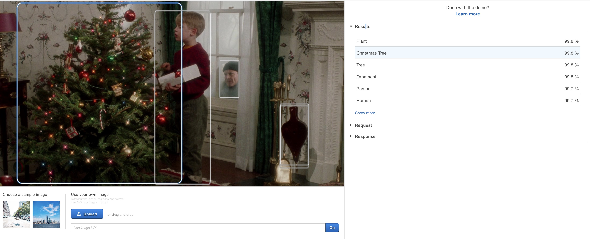
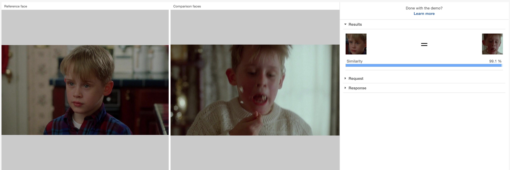

In het verleden heb ik al heel veel bots op de wereld losgelaten. Ik maakte bijvoorbeeld al een bot
die [boetes uitdeelt](https://twitter.com/DT_politie) bij dt-fouten. Eén die [een kaas aanraadt](https://twitter.com/MadammeCheese) wanneer iemand say cheese zegt. Eén die elke dag [een GIF uit The Sound Of Music](https://twitter.com/TheSoundOfGifs) tweet. Om nog maar te zwijgen van de talloze Facebook commentbots

Omdat het bijna kerst is en ik fan ben van hoe ongelofelijk slecht Home Alone wel niet is wou ik nog eens iets maken. Maar wat doe je nog eind 2018, en hoe zorg ik ervoor dat ik geen fouten uit het verleden herhaal?

> _SPOILER:_ [dit](https://www.instagram.com/dailyhomealone) is de bot waar het in dit artikel over gaat.

## It's not you, it's the API.

Het allereerste dat opvalt als je vandaag een bot wil maken is dat het niet meer gaat. De API van Twitter laat bijna niets meer toe, en om te posten heb je toestemming van hen nodig. De API van Instagram [bestaat niet meer](https://developers.facebook.com/blog/post/2018/01/30/instagram-graph-api-updates/) en is vervangen door iets gericht op gladde marketeers en ander krapuul. En bij Facebook is de fun er ook af sinds hun oneindige reeks lekken.

Er zijn leuke open platformen die ontwikkelaars aanmoedigen om crazy shit te ontwikkelen, maar jammer genoeg zit daar niemand op. Sorry, Telegram.

Ik koos Instagram als platform voor mijn bot, en al een geluk is er een Javascript pakket dat alles doet wat hun API deed, en meer: [instagram-private-api](https://github.com/huttarichard/instagram-private-api).

## Bijschaven

Mijn oorspronkelijk idee was om elk uur 1 frame van Home Alone te posten op Instagram. De film duurt 102 minuten. Maal 24 frames zou dat 2448 uur in beslag nemen, of grofweg 16 jaar.

Visueel had dit er prachtig uitgezien op de profielpagina van het account, maar het voelde (als volger van) vooral heel erg veel aan. Daarnaast heb ik al moeite met het onderhouden van een project van een maand, 16 jaar zou me nooit lukken.

Eén post per dag leek me een goed compromis, en per dag springt de film 5 seconden in de tijd. Zo zou het einde toch bereikt moeten zijn tegen 2022.

Next up: hoe ontdekken mensen deze account? De logische manier bij Instagram is door tags te gebruiken. Maar welke?

## Enter the machine

Elke dag dezelfde tags gebruiken: #homealone #daily #still zou lui zijn. We leven in een tijd waarin computers perfect kunnen zien wat er op de foto staat. Dus doen we dat. Amazon biedt [een API](https://aws.amazon.com/rekognition/) aan die 1000 herkenningen doet voor $1.

Wat hij herkent op de foto wordt omgezet in hashtags en aan de caption toegevoegd.

De caption zelf wordt bepaald door wat er op dat moment in de ondertitelingsfile wordt gezegd. Zo valt de film toch min of meer te volgen.

Ex-schoolgenoot Youri stelde op Linkedin voor om de acteurs automatisch te taggen. Jammer genoeg is qua iedereen uit Home Alone dood of in de marginaliteit terecht gekomen. Maar wanneer Kevin of één van de drie andere acteurs met een Instagram in beeld komen worden ze nu ook automatisch getagd. Ook weer dankzij Amazon, niet meer dan 10 minuten werk.

## Blijven draaien & dinero's

Zoals ik al zei heb ik het moeilijk met dingen draaiend te houden. De [TheSoundOfGifs](https://twitter.com/TheSoundOfGifs) bot draaide op een Rapsberry Pi en dat ging goed tot de kuisvrouw kwam, dat stekker uit trok en dat ding niet meer wou opstarten.

Een goedkoop servertje dan maar, al zijn er hier ook gevaren. Binnen een paar maanden ben ik vergeten bij welk bedrijf dat weer draait, dat bedrijf kan failliet gaan, die server kan crashen, en zelfs tegen een schamele 3,5 euro per maand kost me dat op termijn 140 euro.

Op zich valt dat bedrag mee, maar als je zoals mij meer van die stomme projecten hebt lopen, loopt dat op.

Tijd dus voor een buzzword: **serverless**. De code van de bot draait niet op een server die 24/24 aan staat, maar wordt één maal per dag opgestart, doet een tiental seconden lang zijn ding en wordt dan weer afgesloten. Ik moet me niet druk maken over Linuxdingen en kan met een redelijk gerust gevoel de bot gewoon laten draaien.

Het kan nog steeds dat er een fout in de code zit of dat Instagram iets verandert waardoor de bot niet meer functioneert, maar het zal niet meer aan de kuisvrouw liggen als hij plat gaat.

En quanto costa? 0 euro per maand voor de rekenkracht (want Amazon geeft een half miljoen seconden per maand gratis), 1 eurocent voor de opslag van alle afbeeldingen, en 15 eurocent voor de machine learning. In totaal 16 eurocent per maand dus, of 6 euro over het totaal van project.

## Nerdzaken

De broncode staat op Github: [https://github.com/TimBroddin/dailyhomealone](https://github.com/TimBroddin/dailyhomealone)

De afbeeldingen genereer je zo (ondertiteling inbranden en 1 frame per 5 seconden).

    ffmpeg -i HomeAlone.mkv -qscale:v 2 -filter:v "subtitles=Home\ Alone.mkv, fps=0.2" images/image%05d.jpg

## Einde

Oh trouwens, welkom op mijn nieuwe site. Ik kan niks beloven, maar ik ga proberen om hier regelmatig iets zoals dit op te zetten.

Hier kan je de bot vinden: [https://www.instagram.com/dailyhomealone](https://www.instagram.com/dailyhomealone).

Wie Home Alone kak vindt komt [hier](https://www.instagram.com/dailysoundofmusic/) misschien wel aan zijn of haar trekken.
